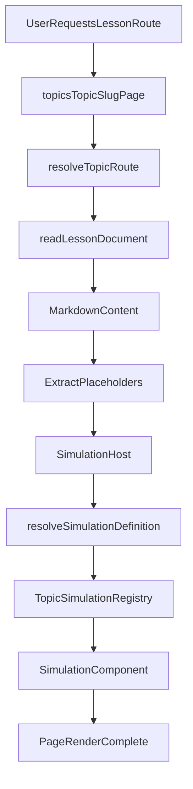

# Request, Content, And Simulation Flow

## Purpose

Describe the end-to-end runtime path from request to rendered lesson, including fallback and error behavior.

## Main Flow

## Content API Flow (`/api/content`)

Source: `src/app/api/content/route.ts`.

- Query parameters:
  - no params: returns all topic indexes
  - `topic`: returns topic with lessons
  - `topic` + `slug`: returns single lesson document
- Validation uses Zod and rejects invalid params with `BAD_REQUEST` (`400`).
- All responses set `x-correlation-id`.
- Success responses are cached with:
  - `Cache-Control: public, s-maxage=3600, stale-while-revalidate=86400`
- Errors are returned with `asErrorEnvelope()` from `src/shared/errors/app-error.ts`.

## Lesson Page Flow (`/topics/[topic]/[slug]`)

Source: `src/app/topics/[topic]/[slug]/page.tsx`.

- `generateStaticParams()` precomputes lesson routes from `TOPIC_ROUTES` and filesystem lesson slugs.
- Route slug resolves to content topic via `resolveTopicRoute()`.
- Lesson content is read from `content/topics/<topic>/<slug>.md|.txt`.
- Missing route or lesson triggers `notFound()`.
- Content body is rendered by client component `MarkdownContent`.

## Placeholder Processing

Source: `src/components/content/MarkdownContent.tsx`.

- Placeholder format:
  - `[[simulation <id>]]`
  - `[[figure <id>]]`
  - `[[code-editor <payload>]]`
- Placeholders are replaced with markers during markdown transformation, then rendered as React components.
- Unknown placeholder type renders a visible error block.

## Simulation Resolution And Fallback

Sources:
- `src/features/simulation/simulation-manifest.ts`
- `src/features/simulation/SimulationHost.tsx`

- `SimulationHost` defers expensive loads until near/in viewport.
- Simulation definitions are lazily resolved by id across topic registries.
- Registry load failures are isolated (one bad registry does not break all simulations).
- If simulation id is not found, host falls back to `InteractiveGraph`.
- If both simulation and fallback fail, host renders an error placeholder.

## Reliability Signals

- `/api/health`: simple liveness JSON (`status: ok`).
- `/api/ready`: content index check; returns `503` when topic index load fails.
- `/api/analytics/web-vitals`: accepts metric payloads, responds `202` on valid body.
- `logRequestMetric()` emits request timing + status + correlation id.

## Actionable Checklist

- For content rendering regressions:
  - verify `resolveTopicRoute()` mapping
  - verify file exists under `content/topics`
  - verify markdown placeholder syntax
- For simulation regressions:
  - run `npm run check:simulations`
  - confirm simulation id exists in topic `*Simulations.tsx` registry
  - verify `simulation-manifest.ts` includes topic registry group
